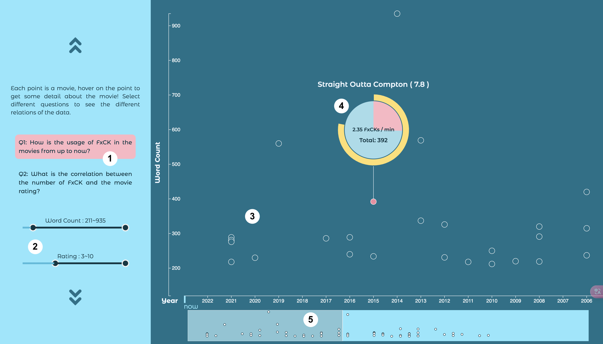
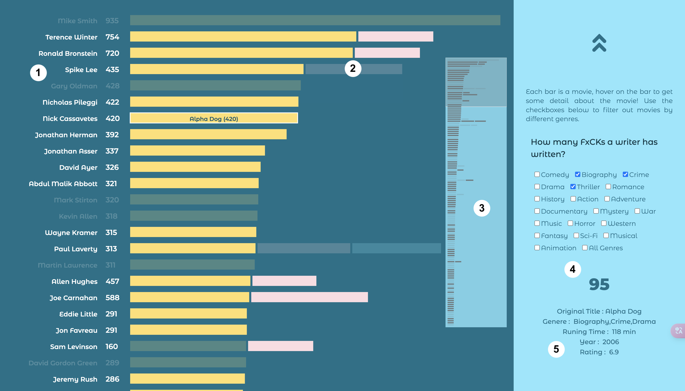

# How Many FXCK in a Movie

This website combines the movie information from <a href="https://www.imdb.com/interfaces/" target="_blank">the IMDb database</a> and the Fxck counting data from <a href="https://www.kaggle.com/datasets/devrimtuner/list-of-films-that-most-frequently-use-the-word" target="_blank">List of films that most frequently use the word F*</a>. The purpose is to explore different ways to present data visually and find some interesting facts from the data.

<h3>
<a href="https://tsengyuhan.github.io/fxck-in-movie/" target="_blank">🎬 Live Demo 🎬 </a>
</h3>

 

### Scatter plot

1. There are two questions can be selected. The scatter plot will change the x-aix and show the corresponding result.
2. Two slider to filter the showing data.
3. Each point is a movie. Hover on the point to get more information.
4. Information about a movie pops up when hovering on the point. The inner pie chart represents the word count in one minute (pink part). It uses the highest record (9.22 words/min) from the dataset as a full pie (100%). The outer yellow ring is the movie's rating from 0-10 and a full ring means 10.
5. A preview window to see the whole scatter plot, helping users to
know how long the chart is. Dragging the gray handle or scrolling on the chart can move left and right.

 

### Bar chart

1. The writer's name and the total amount of FxCKs of a movie.
2. Bar chart of the word count. Each single bar (rectangle) is one movie.
3. A preview window to see the whole bar chart, helping users to know how long the chart is. Dragging the gray handle or scrolling on the chart can move up and down.
4. Filter the chart by genres. The number below are the total number of the movies after filtering.
5. Hovering on each bar can see the movie's name and its word count on the bar, other additional information will show here.

 
 

🐾 This is a course project for learning <a href="https://d3js.org/" target="_blank">d3.js</a> and data visualization. In this [documentation](/documentation.pdf), you can find out how data was processed and the visual design of the project.